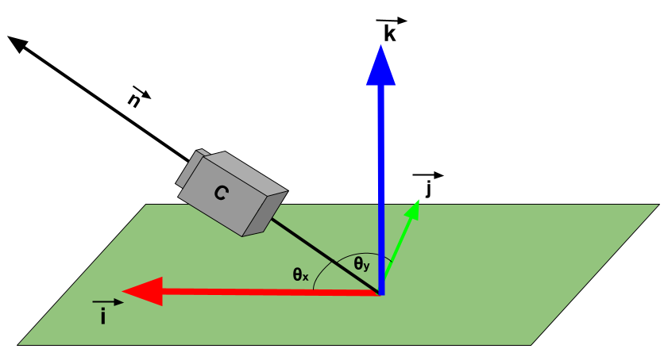

# 3D-Vector-Calculus
> Internal Assessment for IB Mathematics Analysis & Approaches Higher Level (class of 2022) regarding 3D vectors and calculus to find how fast a camera should rotate to record a zipliner as they ascend in the center of the frame. 

Check out the PDF "FINAL_MATH_IA_SUBMITTED" for the full report! The following is a quick sneak peak for what the investigation includes. 

  
  Defining the angles being investigated.

  
  My favourite graph from the exploration for the rate of change the angle between the camera's line of sight and the y-axis. 

  
  A sketch of the zipline being investigated.

